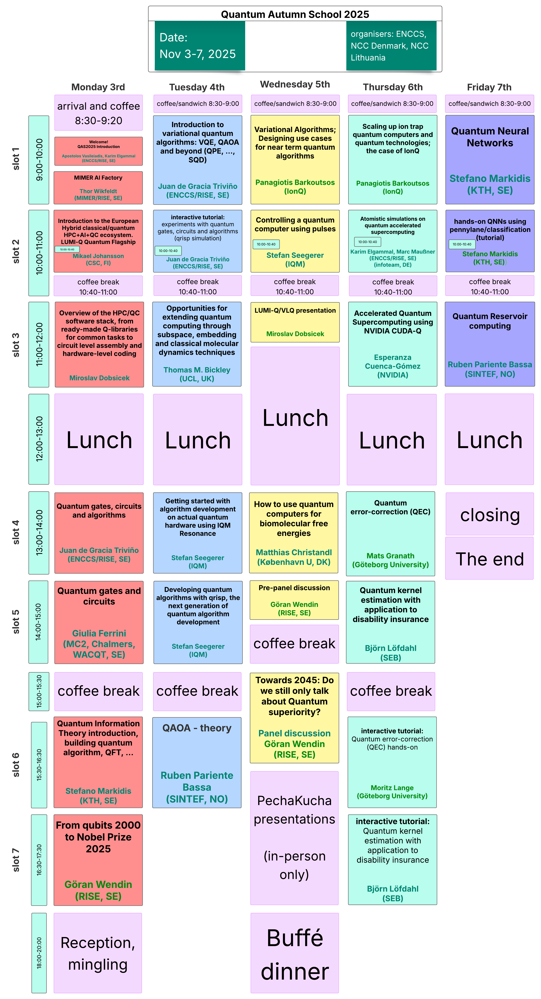

# Quantum Autumn School 2025

:::{admonition} Welcome to QAS2025!
:class: important

Join us for an intensive week of quantum computing education, featuring hands-on tutorials, expert lectures, and European quantum hardware.

**📅 November 3-7, 2025 | 📍 RISE KTH "Innoversum" room, Stockholm, Sweden**

📋 **[Download Agenda (PDF)](resources/QAS2025agenda.pdf)**

🎯 **[Day 0: Pre-Event Information - Start Here!](day0.md)**


:::

## About the school

The Quantum Autumn School 2025 (QAS2025) brings together researchers, students, and industry professionals to explore cutting-edge developments in quantum computing. This 5-day event offers a unique combination of theoretical foundations and practical experience emphasising the integration with High Performance Computing, featuring expert-led sessions that cover a range of topics from theoretical foundations to practical applications. Expect a blend of lectures, hands-on exercises, and networking opportunities, including the chance to interact with stakeholders involved with the [EuroHPC JU quantum computers](https://www.eurohpc-ju.europa.eu/eurohpc-quantum-computers_en). It will provide a valuable opportunity to explore the latest advancements in quantum computing, where you'll learn about up-to-date topics and European quantum efforts, especially in light of the eight [EuroHPC JU quantum computers announcements](https://www.eurohpc-ju.europa.eu/eurohpc-quantum-computers_en), and get hands-on experience.

:::{dropdown} Nordic Quantum Autumn School 2025 - Schedule

```{toctree}
:maxdepth: 2

day0
schedule
day1
day2
day3
day4
day5
related-resources
```
:::

:::{dropdown} What you will learn

QAS2025 will cover a broad range of topics that will give you a solid foundation in theoretical concepts and the practical know-how to get started with quantum computing in your domain. Starting from introductory lectures and basic tutorials at the first days of the school and building up to intermediate and advanced topics towards the end.

**Introduction to quantum algorithms:** Get a quick introduction on quantum computing, quantum information theory and learn how to develop a quantum algorithm. Understand the logic behind, and be able to programmatically create, quantum gates, circuits and algorithms such as QAOA and VQE with their different variations

**Hands-on experience with a quantum computer:** run computational workloads on real quantum hardware, with potential access to EuroHPC JU quantum device like LUMI-Q

**European quantum initiatives:** get an understanding and overview of the quantum computing ecosystem in Europe and globally, including key European quantum initiatives and talks by European hardware providers: IQM and Pasqal

**Use cases:** familiarise yourself with use cases in key domains such as optimisation, quantum chemistry and quantum finance. Learn about the exciting intersection between quantum computing and neural networks with overview on quantum reservoir computing

**Quantum packages:** use common quantum SDKs as Qiskit, Pennylane, learn about the European quantum algorithm development package Qrisp and how to accelerate quantum algorithms using QUDA-Q

**Error correction:** understand quantum error correction and the difference with quantum error mitigation

**HPC & QC workflows:** understand how to run hybrid HPC-QC workflows and accelerate quantum algorithms on GPUs.
:::

## Partners & organizers

This school is organized by EuroCC competence centres of Sweden ENCCS in collaboration with EuroCC Denmark and EuroCC Lithuania. And supported by WACQT, a national research programme, coordinated from Chalmers, that aims to take Swedish research and industry to the forefront of quantum technology.


## Registration & logistics

:::{important}

- 📋 **[Register Now](https://enccs.se/events/qas-2025/)**
- **Capacity**: Limited to ensure quality interaction
- **Format**: In-person event in Stockholm with zoom link (to be distributed)
:::

### Venue

The Quantum Autumn School 2025 is going to be held at the RISE offices on KTH campus Drottning Kristinas väg 61 in room **Innoversum**. The closest metro station (marked T) is **Tekniska Högskolan**.

📍 **[View Location on Maps](https://maps.app.goo.gl/9rphvAS7ugRUC46U8)**

### Accommodation

There are multiple hotels in the vicinity. Below you can find some hotels in order of proximity:

- **[Elite Hotel Arcadia Stockholm](https://www.elite.se/hotell/stockholm/elite-hotel-arcadia-stockholm/?utm_source=google&utm_medium=organic&utm_campaign=google-local&utm_content=stockholm_arcadia)**
- **[Hotel Ruth](https://www.hotelruth.se/)**
- **[Scandic Park](https://www.scandichotels.com/en/hotels/scandic-park)**

For more hotel options, visit the **[event page](https://enccs.se/events/qas-2025/#:~:text=Elite%20Hotel%20Arcadia%20Stockholm)**.

### Public transport

Download the public transport app to purchase tickets:
- **[iOS App Store](https://apps.apple.com/se/app/sl-biljetter/id918418291)**
- **[Google Play](https://play.google.com/store/apps/details?id=com.sl.SLBiljetter)**

**Ticket Options:**
- Single journey ticket
- 24-hour ticket  
- 72-hour ticket

You can also use your regular credit card by scanning it on the metro and all buses. **[More information about contactless payments](https://sl.se/en/in-english/fares--tickets/contactless-pay-as-you-go)**.

**From Arlanda Airport:**
- Take a taxi
- **[Arlanda Express](https://www.arlandaexpress.com/)** - fast train (20 minutes to T-Centralen)
- Flygbussarna - airport bus (approximately 45 minutes to T-Centralen)

### Lunch & social events

- **Lunch**: Provided all days of the event
- **Social Dinner**: Wednesday, November 5th evening

---

## About ENCCS


The EuroHPC Centre of Excellence in Computing Applications (ENCCS) develops and optimizes computational applications for current and upcoming exascale systems. We provide training, support, and expertise in high-performance computing and emerging technologies like quantum computing.

:::{seealso}
**Learn More**
- [ENCCS Website](https://enccs.se)
- [Previous Quantum Schools](https://enccs.se/lessons/)
:::

---

*The lesson file structure and browsing layout is inspired by and derived from work by [CodeRefinery](https://coderefinery.org/) licensed under the [MIT license](http://opensource.org/licenses/mit-license.html).*